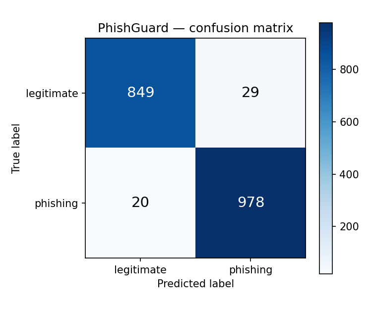
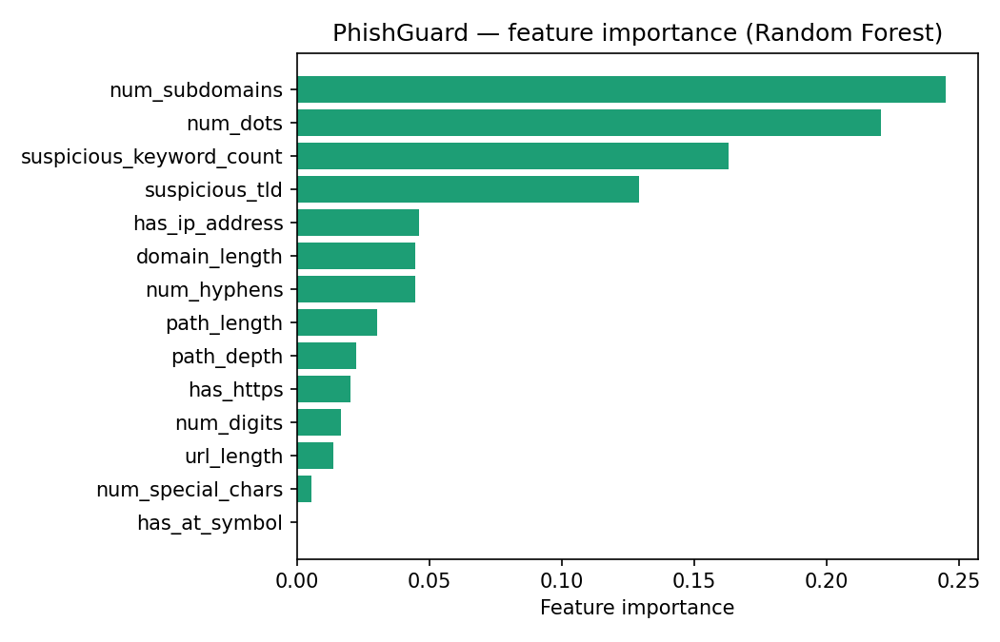

# PhishGuard

A phishing URL detector built with scikit-learn and served through a small Flask API. Give it a URL, it tells you whether it looks like phishing and how confident it is.

I built this to combine my two concentrations (cybersecurity + AI) into one project instead of having them as two separate, unrelated bullet points on a resume.

## What it does

Phishing URLs usually have tells: weird subdomains, brand names with a typo or extra hyphen, sketchy TLDs like `.xyz` or `.click`, IP addresses instead of domain names, and so on. Instead of trying to manually write rules for all of these, I pulled a bunch of these signals out as features and let a Random Forest figure out which ones actually matter.

Everything runs off the URL string itself, no live network calls (no WHOIS, no fetching the actual page), which keeps it fast enough to run in real time.

## Results

| Metric | Score |
|---|---|
| Test accuracy | 97.4% |
| Precision | 97.1% |
| Recall | 98.0% |
| F1 | 97.6% |
| 5-fold CV accuracy | 96.9% (+/- 0.5%) |

Trained on ~9,400 labeled URLs, 80/20 train/test split.




The features that mattered most ended up being subdomain count, dot count, and the presence of suspicious keywords/TLDs, which lines up with what you'd expect from how phishing URLs are usually structured.

## How it's organized

- `feature_extraction.py` — turns a URL string into 14 numeric features
- `data/generate_dataset.py` — builds the labeled dataset (see note below)
- `data/build_features.py` — runs feature extraction over the dataset
- `train_model.py` — trains the Random Forest, saves the model + metrics + plots
- `app.py` — Flask API, `/predict` endpoint
- `test_predictions.py` — quick manual sanity check against a handful of URLs I picked myself

## Running it

```bash
git clone https://github.com/mahekjariya/phishguard.git
cd phishguard
pip install -r requirements.txt

python data/generate_dataset.py
python data/build_features.py
python train_model.py

python app.py
```

Goes to `http://localhost:5050` — there's a basic form there to test URLs, or hit the API directly:

```bash
curl -X POST http://localhost:5050/predict \
  -H "Content-Type: application/json" \
  -d '{"url": "http://paypal-secure-login.xyz/verify/account"}'
```

```json
{
  "url": "http://paypal-secure-login.xyz/verify/account",
  "label": "phishing",
  "is_phishing": true,
  "confidence": 0.8673
}
```

## About the dataset

I generated the dataset synthetically (`data/generate_dataset.py`) instead of pulling live data from PhishTank, mainly so the whole thing is reproducible without depending on an external feed being up. It mimics real phishing patterns (typosquatting, IP-based URLs, subdomain stuffing) and I added some label noise on purpose, since real-world labeling is never perfectly clean and a too-easy dataset gives you a meaningless accuracy number.

If you want to swap in real data, grab a CSV from [PhishTank](https://phishtank.org/developer_info.php) for phishing URLs and the [Tranco list](https://tranco-list.eu/) for legit ones, then point `build_features.py` at the new file. Nothing else needs to change.

## Limitations

- It's trained on synthetic data right now. I'd want to retrain on a real PhishTank export before trusting this on anything that matters.
- No content-based features (page text, visual similarity to the real site) — just URL structure. A more serious version would probably combine this with something that actually looks at the page.
- No domain-age feature since that needs a WHOIS lookup per request, which adds latency and an external dependency I didn't want for this version.

## Stack

Python, pandas, scikit-learn, Flask, matplotlib

## Author

Mahek Jariya — CS @ University of Georgia, concentration in Cybersecurity & AI
[LinkedIn](https://linkedin.com/in/mahek-jariya)
